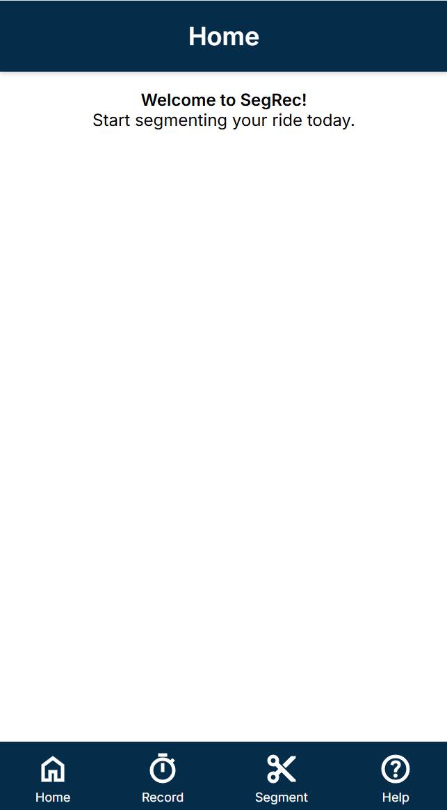
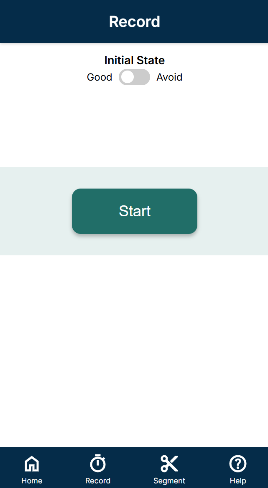
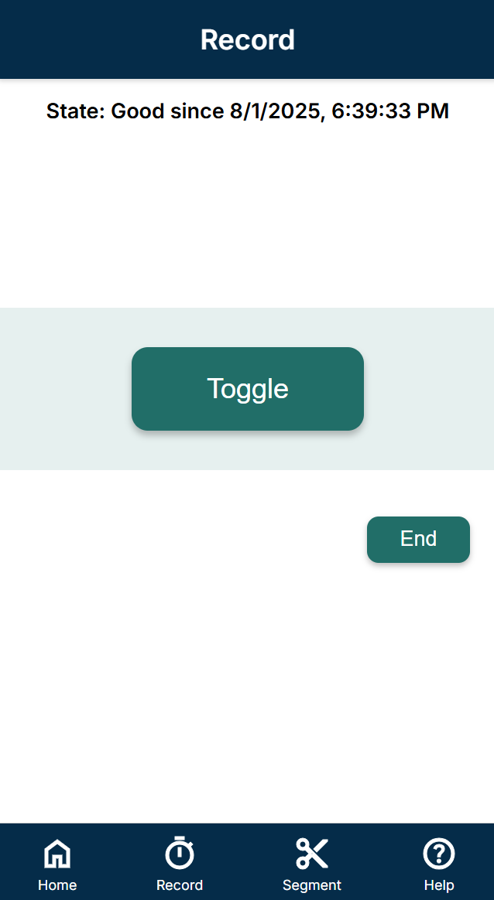
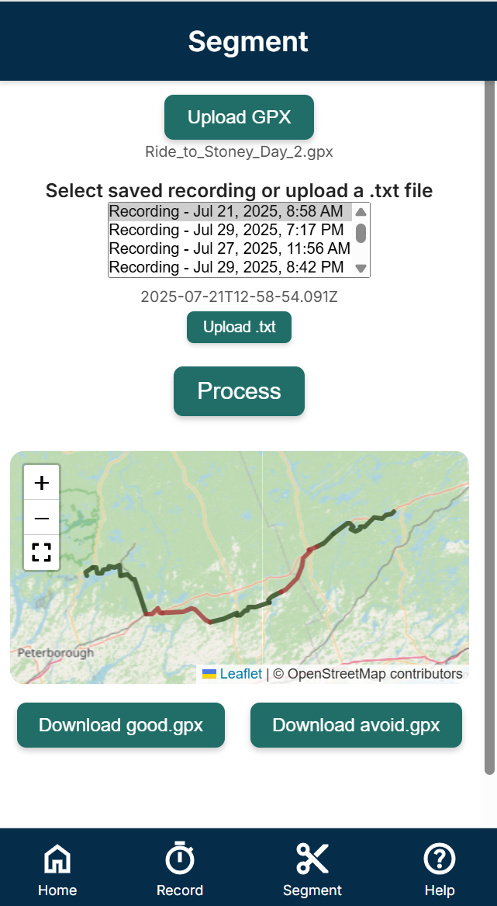
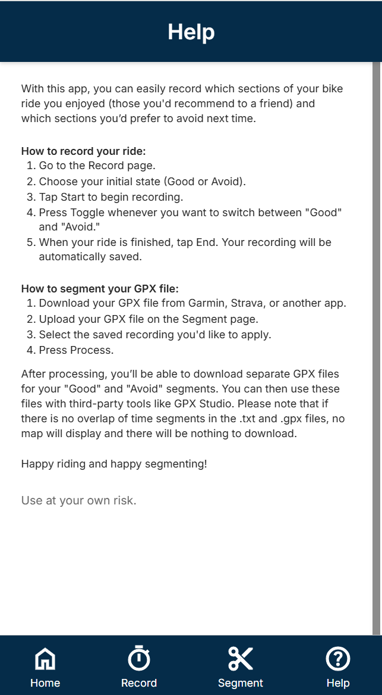

# SegRec
An offline-capable mpbile web app for cyclists to label ride quality (good or avoid) in real time and generate segmented GPX files after the ride.

## What SegRec Does 
SegRec lets cyclists: 
- Mark sections of a ride as "Good" or "Avoid" in real time 
- Save and re-use previous recordings 
- Upload a GPX file after the ride 
- Automatically segment the GPX based on the ride data 
- Download separate GPX files for good and avoid sections 
It works entirely in the browser.

## Demo
Want to try it out?
[Launch the SegRec App](https://celjensen.github.io/SegRec/)

## Screenshots

### Home Screen

### Record Screen (Start)

### Record Screen (In Progress)

### Segment Screen

### Help Screen

## How To Use SegRec
Record Your Ride 
1. Open the Record screen 
2. Set your initial state (Good or Avoid) 
3. Press Start 
4. Tap the toggle button during the ride to switch state 
5. Press End when done 
Your session is saved in the browser automatically 

Process Your Ride 
1. Go to the Segment screen 
2. Upload your GPX file 
3. Select a saved recording (or upload a TXT file) 
4. Click Process 
5. Preview your segmented ride on the map 
6. Download good.gpx and avoid.gpx 

## Future Updates 
GPX overlap validation: Show a warning if no GPX trackpoints match any recorded segment intervals.  
Add segment notes: Allow users to attach notes to segments, with optional voice/microphone input.  
Desktop version: Build a desktop-friendly layout with optimized interactions for larger screens.  
Strava integration: Enable importing or syncing GPX data with Strava for easier sharing and tracking.  

## Technologies
- HTML, CSS, JavaScript 
- Leaflet.js (for GPX map display)
- LocalStorage (for offline support)

## Privacy
SegRec stores all ride data locally in your browser. Nothing is uploaded or tracked.

## License
SegRec is open source under the MIT License.

